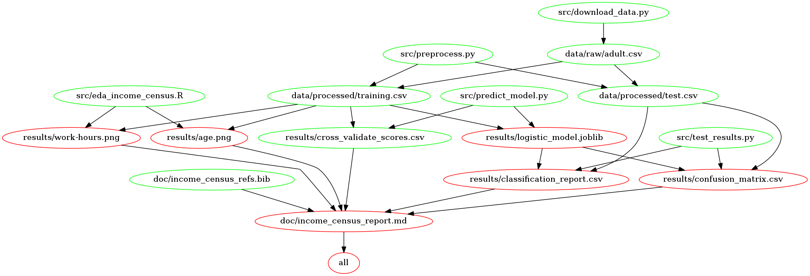

# Income Status Predictor
Co-authors: Aishwarya Gopal, Fei Chang, Yanhua Chen

## About

Here we attempt to build a classification model using the Logistic Regression algorithm which uses a set of features like age, workclass, education etc to classify the income levels of an indivduals into one of the two categories: >$50k/year or <=$50k/year. (we use "1" to represent \>\$50k/year, and "0" to represent \<=\$50k/year). Our final Logistic Regression model performed well on the test data set. The target class >=50k was encoded as 1 and the other class as 0. We obtained an f1 score of 1 and an overall accuracy calculated to be 1. It correctly predicted the income class of 7963 individuals. However it incorrectly predicted 1806 examples.

The Census Income Dataset is created by Ronny Kohavi and Barry Becker, and sourced from the UCI Machine Learning Repository [http://archive.ics.uci.edu/ml]. This is a classification dataset and we will complete a classification task to predict whether or not a person can earn more than $50k/yr for this project. We will use the binary attribute "income" as our target, which includes two values: ">50K" and "<=50K". There are 14 explanatory variables in the dataset, 6 are numeric features and 8 are categorical features. Each row contains one observation with the 14 explanatory variables(personal information) and the relative income status. There are 48842 observations in the dataset.

## Report

The final report can be found [here](http://htmlpreview.github.io/?https://raw.githubusercontent.com/UBC-MDS/DSCI_522_Group_18/main/doc/income_census_report.html)

## Usage

##### 1. Using Docker

note - the instructions in this section also depends on running this in a unix shell (e.g., terminal or Git Bash)

To replicate the analysis, install [Docker](https://www.docker.com/get-started). Then clone this GitHub repository and run the following command at the command line/terminal from the root directory of this project:

```
docker run --rm -v /$(pwd):/home/rstudio/income_project yhchen20/income-prediction:latest make directory=/home/rstudio/income_project all
```

To reset the repo to a clean state, with no intermediate or results files, run the following command at the command line/terminal from the root directory of this project:

```
docker run --rm -v /$(pwd):/home/rstudio/income_project yhchen20/income-prediction:latest make directory=/home/rstudio/income_project clean
```


##### 2. Without using Docker
To replicate the analysis, clone this GitHub repository, install the dependencies listed below, and run the following command at the command line/terminal from the root directory of this project:

```
make all
```

To reset the repo to a clean state, with no intermediate or results files, run the following command at the command line/terminal from the root directory of this project:
```
make clean
```

To find the dependencies of makefile, see the figure below:




## Dependencies

* Python 3.7.3 and Python packages:
    
    docopt==0.6.2
    
    requests==2.24.0
    
    pandas==0.24.2
    
    numpy==1.19.1
    
    scikit-learn==0.23.2
    
    joblib==0.17.0


* R version 4.0.2 and R packages:
    
    knitr==1.29
    
    tidyverse==1.3.0
    
    kableExtra==1.3.1
    
    ggplot2==3.3.2
    
    reshape2==1.4.4

* GNU make 4.2.1

## Citation
Ron Kohavi, "Scaling Up the Accuracy of Naive-Bayes Classifiers: a Decision-Tree Hybrid", Proceedings of the Second International Conference on Knowledge Discovery and Data Mining, 1996

Dua, D. and Graff, C. (2019). UCI Machine Learning Repository [http://archive.ics.uci.edu/ml]. Irvine, CA: University of California, School of Information and Computer Science.
